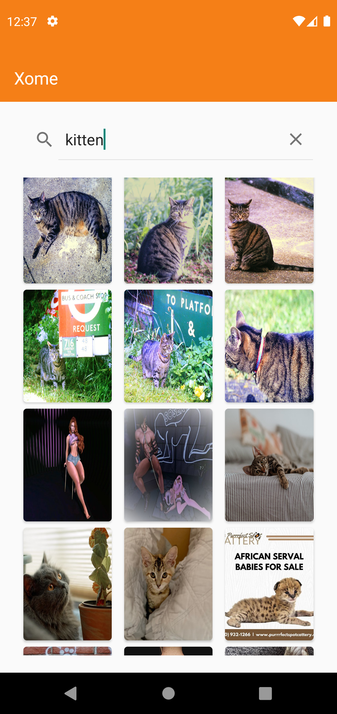
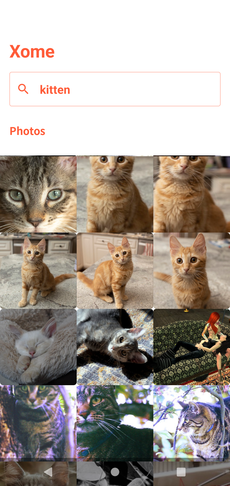
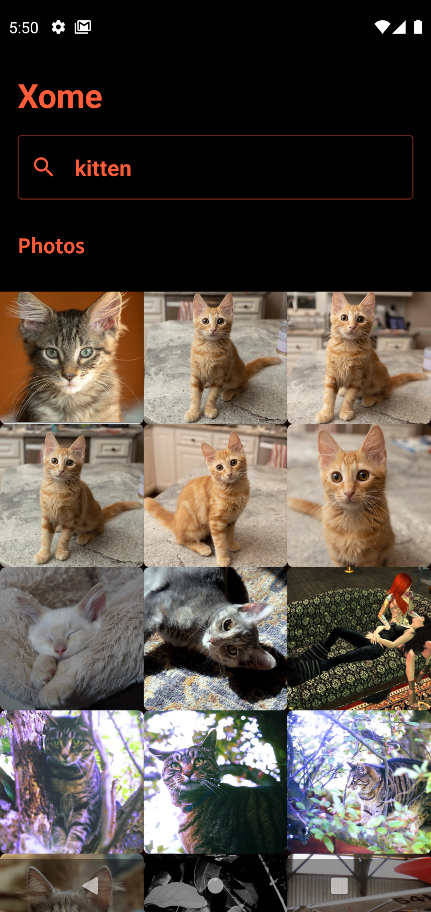

# Xome Android App

Xome Flickr images

## APK File
https://github.com/rramprasad/Xome/releases/download/1.0.0/xome-app-release.apk

## App Screens

## Introduction
This app shows list of images from Flickr based on the user search keyword

## Development IDE
- Android Studio Bumblebee | 2021.1.1 Canary 3

## Android Libraries/components used:
- [Architecture Componenets ViewModel](https://developer.android.com/topic/libraries/architecture/viewmodel)
- [Hilt Dependency Injection](https://developer.android.com/training/dependency-injection/hilt-android)
- [Picasso]
- [Retrofit]

## Jetpack Compose Version:
Additionally I have used [Jetpack Compose](https://developer.android.com/jetpack/compose) for UI development instead of using traditional views. So this Jetpack compose version developed without using fragments and XML layouts.

## Android Libraries/components used with Jetpack Compose:
- [Architecture Componenets](https://developer.android.com/topic/libraries/architecture/viewmodel)
- [Hilt Dependency Injection](https://developer.android.com/training/dependency-injection/hilt-android)
- Retrofit
- Accompanist Coil
- Android 12 SplashScreen API

## Jetpack Compose Version Code
- Branch Name : compose_version

## Jetpack Compose version APK File
https://github.com/rramprasad/Xome/releases/download/1.0.1/xome-compose-release.apk
